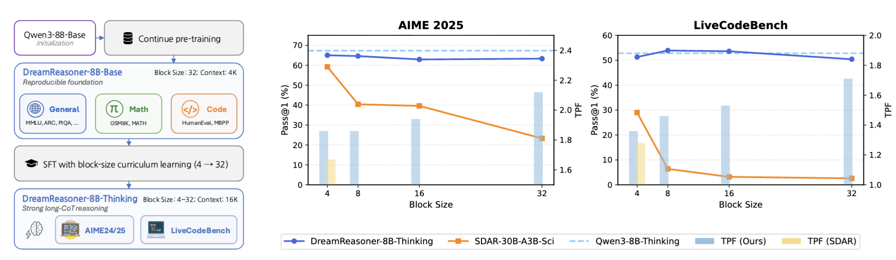

# DreamReasoner-8B

[](https://arxiv.org/abs/2606.19257)
[](https://huggingface.co/Dream-org/DreamReasoner-8B)
[](https://huggingface.co/Dream-org/DreamReasoner-8B-Base)
[](LICENSE)

**DreamReasoner-8B** is an open-source block diffusion reasoning model designed for complex mathematical reasoning and code generation. Through block-size curriculum learning, we adapt Qwen3-8B-Base to a block diffusion model with performance comparable to Qwen3-8B-Thinking.




https://github.com/user-attachments/assets/de44de37-f94f-40c6-b825-3137c08c8736

## 🚀 Quick Start

```python
from transformers import AutoModelForCausalLM, AutoTokenizer
MODEL_PATH = "Dream-org/DreamReasoner-8B"
PROMPT = (
    "If $f(x) = \\frac{3x-2}{x-2}$, what is the value of $f(-2)+f(-1)+f(0)$? "
    "Express your answer as a common fraction."
)

model = AutoModelForCausalLM.from_pretrained(
    MODEL_PATH,
    trust_remote_code=True,
)
tokenizer = AutoTokenizer.from_pretrained(MODEL_PATH, trust_remote_code=True)
model.to("cuda").eval()

# Format the prompt with the model's chat template.
messages = [{"role": "user", "content": PROMPT}]
prompt_text = tokenizer.apply_chat_template(
    messages,
    add_generation_prompt=True,
    tokenize=False,
    enable_thinking=True, 
)
inputs = tokenizer(prompt_text, return_tensors="pt", add_special_tokens=False)
input_ids = inputs["input_ids"].to(model.device)
prompt_length = input_ids.shape[1]

output = model.block_diffusion_generate(
    input_ids=input_ids,
    max_new_tokens=2048,
    block_length=32,
    return_dict_in_generate=True,
)

generated_ids = output.sequences[0, prompt_length:]
text = tokenizer.decode(generated_ids, skip_special_tokens=True)
print(text)
```


## Inference with Sglang
We support inference through SGLang, and the current implementation can be found in our [sglang fork](https://github.com/WilliamZR/sglang/tree/feature/dream-support).
```
import sglang as sgl
from transformers import AutoTokenizer

tokenizer = AutoTokenizer.from_pretrained("Dream-org/DreamReasoner-8B", trust_remote_code = True)
prompts = [
    "Let $x,y$ and $z$ be positive real numbers that satisfy the following system of equations: [\\log_2\\left({x \\over yz}\\right) = {1 \\over 2}\\]\\[\\log_2\\left({y \\over xz}\\right) = {1 \\over 3}\\]\\[\\log_2\\left({z \\over xy}\\right) = {1 \\over 4}\\] Then the value of $\\left|\\log_2(x^4y^3z^2)\\right|$ is $\\tfrac{m}{n}$ where $m$ and $n$ are relatively prime positive integers. Find $m+n$.",
    "Jen enters a lottery by picking $4$ distinct numbers from $S=\\{1,2,3,\\cdots,9,10\\}.$ $4$ numbers are randomly chosen from $S.$ She wins a prize if at least two of her numbers were $2$ of the randomly chosen numbers, and wins the grand prize if all four of her numbers were the randomly chosen numbers. The probability of her winning the grand prize given that she won a prize is $\\tfrac{m}{n}$ where $m$ and $n$ are relatively prime positive integers. Find $m+n$."
]
messages = [[{"role": "user", "content": p}] for p in prompts]
inputs = [tokenizer.apply_chat_template(
    m, tokenize=False, add_generation_prompt=True, return_dict=False
) for m in messages]

llm = sgl.Engine(model_path="Dream-org/DreamReasoner-8B", trust_remote_code = True, dllm_algorithm='LowConfidence')
sampling_params = {"temperature": 0.0,  "max_new_tokens": 2048}

outputs = llm.generate(inputs, sampling_params)
for prompt, output in zip(prompts, outputs):
    print("===============================")
    print(f"Prompt: {prompt}\nGenerated text:\n... {output['text'][-500:]}")
```


## Citation
```
@misc{wu2026dreamreasoner8bblocksizecurriculumlearning,
      title={DreamReasoner-8B: Block-Size Curriculum Learning for Diffusion Reasoning Models}, 
      author={Zirui Wu and Lin Zheng and Jiacheng Ye and Shansan Gong and Xueliang Zhao and Yansong Feng and Wei Bi and Lingpeng Kong},
      year={2026},
      eprint={2606.19257},
      archivePrefix={arXiv},
      primaryClass={cs.CL},
      url={https://arxiv.org/abs/2606.19257}, 
}
```
